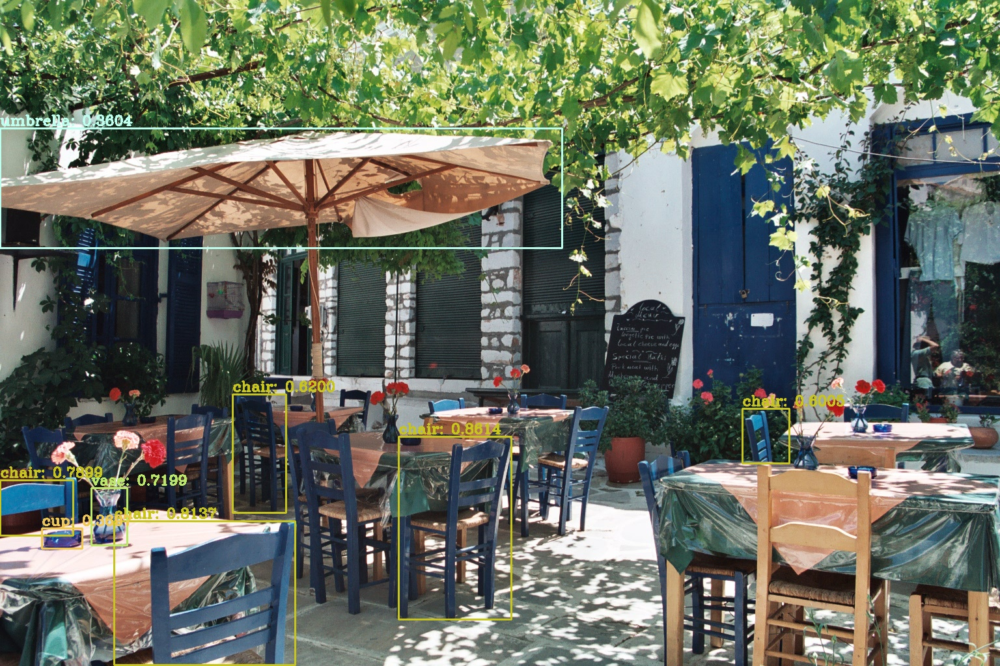

# Yolov5-tf2
Yolov5 Tensorflow 2 detection implementation (no training). This project uses a Tensorflow <code>saved_model</code> format for Yolov5 object detection. For training and exporting please check the [Yolov5 repository](https://github.com/ultralytics/yolov5). 



## Features 

- Detecting objects in an image folder, an image, a video or webcam.
- Able to use custom trained <code>saved_model</code>'s [(only size 640 models)](https://github.com/ultralytics/yolov5#pretrained-checkpoints)
- Drawing bounding boxes in images.
- Usage of non max suppression.
- Automatically write images with bounding boxes (no videos yet).

## Usage
### Clone and install requirements
```
$ git clone https://github.com/Jeremy-vdw/Yolov5-tf2.git
$ cd Yolov5-tf2
$ pip install -r requirements.txt
```

### Run example
```
$ python detect.py --source './data/images/' --prob 0.4
```

### Parameters
- <code>--saved_model</code> path to saved_model.<code>yolov5s</code> as default
- <code>--labels</code> path to labels (.names) file. <code>data/coco.names</code> as default
- <code>--source</code> path to input image/video/image_folder. 
- <code>--prob</code> minimum probability to eliminate weak predictions. <code>0.7</code> as default
- <code>--thres</code> setting threshold for filtering weak bounding boxes with NMS. <code>0.3</code> as default
- <code>--visualize</code> to show bounding boxes. <code>True</code> as default.

